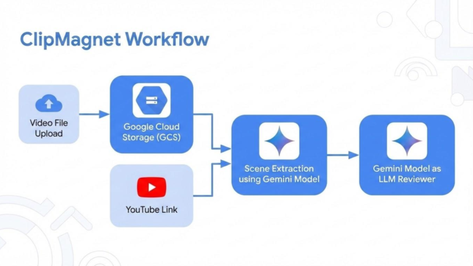
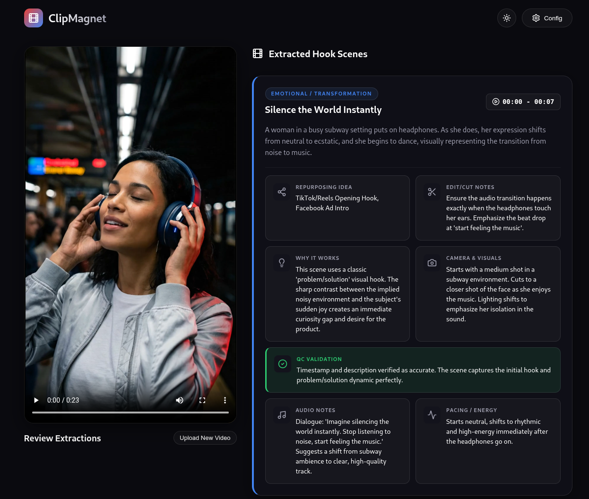

# ClipMagnet 🎬🧲

ClipMagnet is a modern web application powered by **Google Gemini** models that analyzes long-form videos and automatically extracts key "hook" scenes — the high-retention, viral-worthy moments that matter most to content editors and strategists.

It supports two authentication modes out of the box: **Vertex AI** (Google Cloud ADC) and the **Gemini Developer API** (API key), with automatic routing between them based on your environment configuration.

---

## ✨ Features

- **Intelligent Hook Extraction** — Analyzes the full video chronologically to find retention-spiking moments across categories: Curiosity Gap, High-Impact Action, Comedic Beats, Emotional moments, Controversial takes, and more.
- **Two-Stage AI Pipeline** — Stage 1 extracts scenes creatively (temperature=1); Stage 2 re-watches the video and QC-checks every timestamp and description for accuracy.
- **Dual Auth Support** — Works with both Vertex AI (Google Cloud ADC) and the Gemini Developer API. Switches automatically based on environment variables.
- **Four Video Ingestion Paths** — YouTube URL, GCS bucket upload, Vertex AI inline bytes, or Gemini Files API — the right path is chosen automatically.
- **Dynamic Model Selector** — Model dropdown is driven by the backend config, not hardcoded in the UI.
- **Detailed Editor Metadata** — Every hook scene includes timestamps, category, description, editing justification, camera/visual notes, audio cues, pacing, repurposing ideas, and cut notes.
- **GCS Integration** — Optional Google Cloud Storage upload for large files (recommended for files >100 MB on Vertex AI).
- **Premium Glassmorphic UI** — Responsive React interface with smooth animations, interactive timestamp seeking, and dynamic Light/Dark mode.

---

## 🏗️ Architecture

```text
ClipMagnet/
├── backend/               # FastAPI + Python (AI orchestration)
│   ├── main.py            # API endpoints: /api/config, /api/status, /api/extract
│   └── gemini_service.py  # Two-stage Gemini pipeline + auth routing
├── frontend/              # React + Vite (single-component app)
│   └── src/App.jsx        # All state, UI, and handlers
└── .env.example           # Auth configuration template
```

### Workflow



### Video Ingestion Paths

| Input | Auth | Storage | Method |
| --- | --- | --- | --- |
| YouTube URL | Either | — | `Part.from_uri(url)` |
| Local file | Either | GCS bucket set | GCS upload → `Part.from_uri(gs://...)` |
| Local file | Vertex AI | No GCS | `Part.from_bytes()` — inline |
| Local file | Developer API | No GCS | `client.files.upload()` + poll |

---

## 🚀 Getting Started

### Prerequisites

- **Python 3.9+** and **Node.js (npm)**
- One of the following:
  - **Vertex AI:** A Google Cloud project with the Vertex AI API enabled + [ADC credentials](https://cloud.google.com/docs/authentication/provide-credentials-adc)
  - **Gemini Developer API:** An API key from [Google AI Studio](https://aistudio.google.com)

---

### Quick Start

**1. Install dependencies:**

```bash
make setup
```

**2. Configure your environment:**

```bash
cp .env.example .env
```

Edit `.env` and fill in your credentials (see [Configuration](#%EF%B8%8F-configuration) below).

**3. Start the application:**

```bash
make run
```

- Frontend: `http://localhost:5173`
- Backend API: `http://localhost:8000`

---

### Manual Setup

**Backend:**

```bash
cd backend
python3 -m venv venv
source venv/bin/activate
pip install -r requirements.txt
uvicorn main:app --reload
```

> **Note for Googlers / Corp users:** If you face SSO connectivity issues during `pip install`, run `gcert` first.

**Frontend** (in a separate terminal):

```bash
cd frontend
npm install
npm run dev
```

---

## ⚙️ Configuration

Copy `.env.example` to `.env` and activate one of the two auth modes:

### Option A — Vertex AI (Google Cloud ADC)

```env
GOOGLE_GENAI_USE_VERTEXAI=TRUE
GOOGLE_CLOUD_PROJECT=your-gcp-project-id
GOOGLE_CLOUD_LOCATION=global
GCP_PROJECT_ID=your-gcp-project-id
GCP_LOCATION=global
```

Then authenticate:

```bash
gcloud auth application-default login
```

> **Note:** The `gemini-3-pro-preview` and `gemini-3.1-pro-preview` models are available in the `global` region only. Using `us-central1` will result in a 404 error.

### Option B — Gemini Developer API

```env
GEMINI_API_KEY=your-api-key-here
```

Get a free API key at [aistudio.google.com](https://aistudio.google.com).

### Shared Settings

```env
DEFAULT_MODEL=gemini-3-pro-preview   # or gemini-3.1-pro-preview
GCS_BUCKET=                          # Optional; recommended for files >100 MB on Vertex AI
```

---

## 🎬 Usage

1. Open `http://localhost:5173` in your browser.
2. Click the **Config** (gear icon) to select a Gemini model or set a GCS bucket. The help text automatically reflects which auth mode is active.
3. Toggle **Light/Dark** mode with the Sun/Moon icon.
4. Choose **Local File** or **YouTube Link** mode.
5. Drag and drop a video (or paste a YouTube URL) and click **Extract Hook Scenes**.
6. Review the generated scene cards — click any timestamp badge to seek the video directly to that moment.

**Sample Response:**



---

## 🧪 Technologies

| Layer | Stack |
| --- | --- |
| Frontend | React, Vite, Lucide React, Vanilla CSS |
| Backend | Python, FastAPI, python-multipart, python-dotenv |
| AI | `google-genai` SDK, Gemini 3 / 3.1 Pro models |
| Auth | Vertex AI (Google Cloud ADC) or Gemini Developer API key |
| Storage | Google Cloud Storage (optional) |

---

## 🤝 Contributing

Contributions are welcome! Please feel free to submit a Pull Request.

---

## ⚠️ Disclaimer

This project is a use case demonstration for Gemini. It is experimental and **NOT** an official Google product. It does not reflect the official products or policies of Google or Google Cloud.
