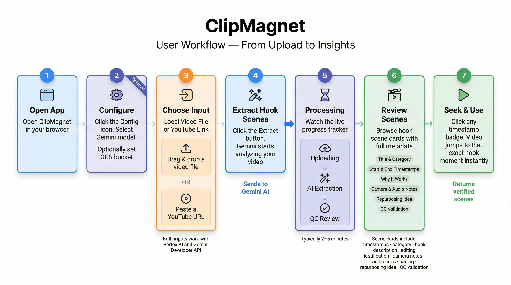
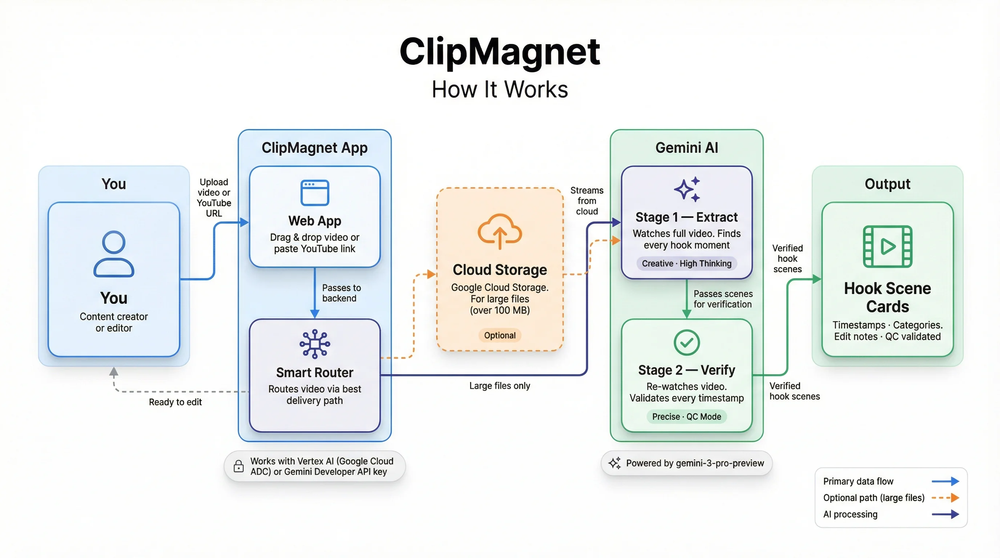
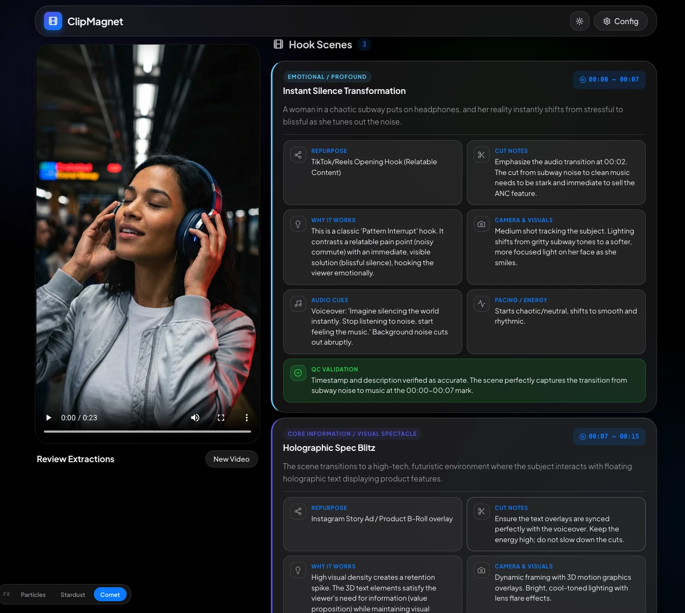
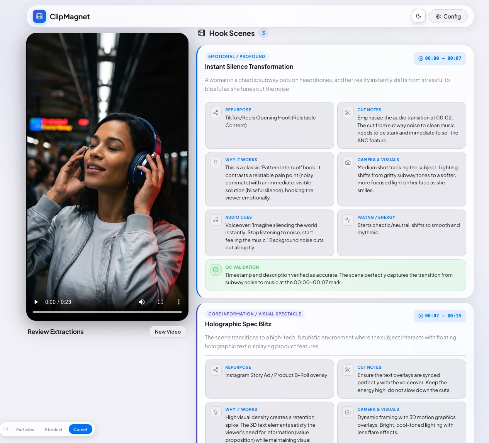

<div align="center">

# ClipMagnet

**AI-powered video hook extractor.**
Drop a video in, get every viral moment out.

Built with [Gemini 3 Pro](https://ai.google.dev/) &nbsp;·&nbsp; [FastAPI](https://fastapi.tiangolo.com/) &nbsp;·&nbsp; [React](https://react.dev/)

</div>

---

ClipMagnet analyzes long-form videos and automatically surfaces high-retention "hook" scenes — the viral-worthy moments that matter most to content editors and strategists. It runs a **two-stage Gemini AI pipeline**: Stage 1 creatively extracts every hook moment; Stage 2 re-watches the video and QC-validates every timestamp.

Supports **Vertex AI** (Google Cloud ADC) and the **Gemini Developer API** — switch between them with a single env variable.

<br>

## How It Works

<div align="center">



</div>

<br>

| Step | What Happens |
|:--|:--|
| **1. Open App** | Visit `localhost:5173` in your browser |
| **2. Configure** | Click ⚙ Config — select Gemini model, optionally set a GCS bucket for large files |
| **3. Choose Input** | Drag & drop a video file **or** paste a YouTube URL (Recommended video length: 15-30 mins) |
| **4. Extract** | Click **Extract Hook Scenes** — Gemini starts analyzing your full video |
| **5. Processing** | Live progress tracker: Uploading → AI Extraction → QC Review (typically 2–5 min) |
| **6. Review Scenes** | Browse hook scene cards with full editor metadata per scene with option to download the result as PDF or JSON |
| **7. Seek & Use** | Click any timestamp badge — the video jumps to that exact moment instantly |

Each scene card includes: `title` · `timestamps` · `category` · `description` · `editing justification` · `camera notes` · `audio cues` · `pacing` · `repurposing idea` · `QC validation`

<br>

## Quick Start

```bash
# 1. Clone
git clone https://github.com/SunilKumarJB/ClipMagnet.git
cd ClipMagnet

# 2. Configure
cp .env.example .env
# Edit .env — pick Vertex AI or Developer API (see Configuration below)

# 3. Install & run
make setup    # Installs backend + frontend dependencies
make run      # Starts backend (8000) + frontend (5173)
```

Open **http://localhost:5173** and start extracting.


<br>

## Prerequisites

| Requirement | Details |
|:--|:--|
| Python 3.9+ | [python.org](https://www.python.org/downloads/) |
| Node.js + npm | [nodejs.org](https://nodejs.org/) |
| **Option A** — Vertex AI | GCP project with Vertex AI API enabled + [ADC credentials](https://cloud.google.com/docs/authentication/provide-credentials-adc) |
| **Option B** — Developer API | Free API key from [Google AI Studio](https://aistudio.google.com) |

<br>

## Architecture

<div align="center">



</div>

<br>

| Layer | Stack |
|:--|:--|
| **Frontend** | React + Vite — glassmorphic dark/light UI, live status polling, interactive timestamp seeking |
| **Backend** | FastAPI (Python) — `/api/config`, `/api/extract`, `/api/status/{job_id}` |
| **AI Pipeline** | Stage 1: hook extraction (temp=1.0, thinking=HIGH) · Stage 2: QC review (temp=0.5, thinking=HIGH) |
| **Auth** | Vertex AI (Google Cloud ADC) or Gemini Developer API — auto-routed via env vars |
| **Storage** | Google Cloud Storage (optional, recommended for files > 100 MB on Vertex AI) |

<br>

## Demo

<div align="center">

<table>
  <tr>
    <td></td>
    <td></td>
  </tr>
  <tr>
    <td align="center"><sub>Dark Theme</sub></td>
    <td align="center"><sub>Light Theme</sub></td>
  </tr>
</table>

<br>

<a href="https://drive.google.com/file/d/1wwT7PZCXNSwJ2qV4V8kFWsif9F2WQP5v/view?usp=sharing">
  
</a>

<sub>▶ Click to watch the full demo on Google Drive</sub>

</div>

<br>

## Configuration

Copy `.env.example` to `.env` and activate one auth mode:

### Option A — Vertex AI (Google Cloud ADC)

```env
GOOGLE_GENAI_USE_VERTEXAI=TRUE
GOOGLE_CLOUD_PROJECT=your-gcp-project-id
GOOGLE_CLOUD_LOCATION=global
GCP_PROJECT_ID=your-gcp-project-id
GCP_LOCATION=global
```

```bash
gcloud auth application-default login
```

> Use `global` region — `gemini-3-pro-preview` and `gemini-3.1-pro-preview` are only available there. `us-central1` returns a 404.

### Option B — Gemini Developer API

```env
GEMINI_API_KEY=your-api-key-here
```

Get a free key at [aistudio.google.com](https://aistudio.google.com).

### Shared Settings

```env
DEFAULT_MODEL=gemini-3-pro-preview   # or gemini-3.1-pro-preview
GCS_BUCKET=                          # optional; recommended for files > 100 MB on Vertex AI
```

<br>

## Video Ingestion Paths

ClipMagnet automatically picks the right path based on your input and auth config:

| Input | Auth | Storage | Method |
|:--|:--|:--|:--|
| YouTube URL | Either | — | Direct URI to Gemini |
| Local file | Either | GCS bucket set | Upload to GCS → `gs://` URI |
| Local file | Vertex AI | No GCS | Inline bytes via `Part.from_bytes()` |
| Local file | Developer API | No GCS | `client.files.upload()` + active-state poll |

<br>

## Key Features

- **Two-Stage AI Pipeline** — Stage 1 extracts creatively at high temperature; Stage 2 re-watches and verifies every timestamp for accuracy
- **Four Ingestion Paths** — YouTube, GCS, inline bytes, and Files API — the right path is chosen automatically
- **Dual Auth** — Vertex AI and Developer API with zero code changes; swap via `.env`
- **Live Progress** — Real-time status polling shows pipeline stage during processing
- **Interactive Seeking** — Click any timestamp badge to jump the video player to that exact scene
- **Dynamic Model Picker** — Model list driven by backend config, not hardcoded
- **Mouse FX** — Three canvas-based cursor effects (Particles, Stardust, Comet) with in-app toggle

<br>

## Commands

```bash
make setup    # Install all dependencies (first time only)
make run      # Start backend (8000) + frontend (5173)
```

**Manual (if needed):**

```bash
# Backend
cd backend && python3 -m venv venv && source venv/bin/activate
pip install -r requirements.txt
uvicorn main:app --reload

# Frontend (separate terminal)
cd frontend && npm install && npm run dev
```

<br>

## Models

| Model | Use Case |
|:--|:--|
| `gemini-3-pro-preview` | Default — best quality hook extraction and QC |
| `gemini-3.1-pro-preview` | Alternative — global region only |

<br>

## Troubleshooting

<details>
<summary><strong>"This method is only supported in the Gemini Developer client"</strong></summary>

You're uploading a local file while configured for Vertex AI with no GCS bucket set.

**Fix:** Either set `GCS_BUCKET` in your `.env`, or switch to Developer API mode.
</details>

<details>
<summary><strong>404 on model request</strong></summary>

You're using `us-central1` instead of `global`.

**Fix:** Set `GOOGLE_CLOUD_LOCATION=global` and `GCP_LOCATION=global` in `.env`.
</details>

<details>
<summary><strong>Port already in use</strong></summary>

```bash
lsof -ti:8000,5173 | xargs kill -9
make run
```
</details>

<br>

---

<div align="center">

[**Sunil Kumar**](https://www.linkedin.com/in/sunilkumar88/) &bull; [**Lavi Nigam**](https://www.linkedin.com/in/lavinigam/)

<sub>A Gemini use-case demonstration. Not an official Google product.</sub>

</div>
